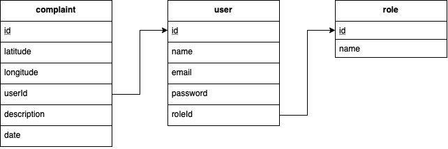

# NodeJS Labs

## Description

**This is an app for "NodeJS Basics" course which will allow user to store and see complains left by other users.**

## Stack

### **Technologies:**

- **_JavaScript_ –** was chosen by us because we already have experience with this compiler.
- **_Express_ –** was chosen because it allows to easily build different kind of web apps in short period of time.
- **_PostgreSQL_ –** because of it's many features aimed to help developers build applications and simplicity to use with JS.
- **_knex_ –** because of it's popular and lightweight ORM for node.js
- **_joi_ –** because of it's the most powerful schema description language and data validator for JavaScript

## **Database Scheme:**

